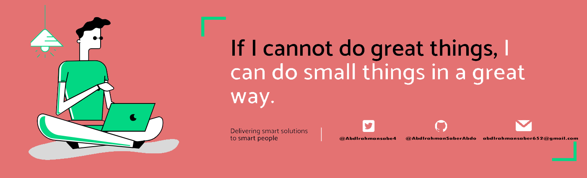

<h1 align="center">Hello I'm Mohammed Aldirawi</h1>

<!--
**soumyajit4419/soumyajit4419** is a ✨ _special_ ✨ repository because its `README.md` (this file) appears on your GitHub profile.
Here are some ideas to get you started: -->
<!-- 

  
  

-->

  
 

## 👨🏻‍💻 About Me:

- 🙋‍♂️ All about me is at **[My Resume](https://drive.google.com/file/d/1vIEp2G4zlP44JZumRq7Jw7FZjACyrzAJ/view?usp=sharing)**

- 🌱 I’m currently `MERN Stuck`.

- 🔭 I’m currently working as `Something Interesting`.

- 🤔 I’m working on improving my skills in `Web Development`

- 💬 Ask me about anything :) 

- 👨‍💻 Life Hack: Learn new tech :fire: and share what you have learned :tada:

## 🛠️ Technologies and Tools I use:

 

## ❤️ Let's get connected:

   
   
   
   

## What if you like my work? 🤩
<ul>
  <li>You can Star ⭐ the repositories you like.</li>
  <li>You can react ❤️ to my LinkedIn posts.</li>
</ul>

